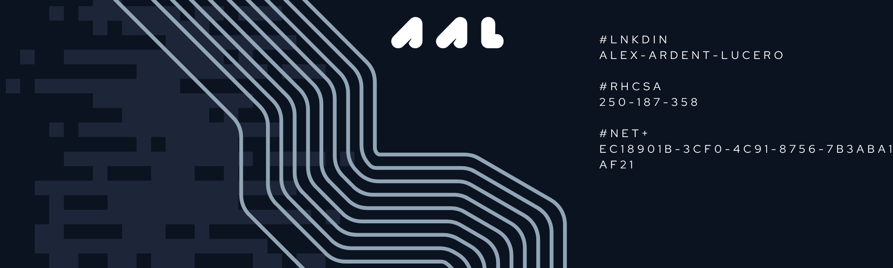

git ⌬ 1970-01-01T00:00:00Z  
↯ aex-a $ fastfetch

SYSTEM INFORMATION  
ROLE \- NOC Technician II \-\> Junior SRE  
CERT \- RHCSA (ID: 250-187-358)  
OS \- openSUSE Tumbleweed \/ Fedora \/ RHEL 10  
IAC \- OpenTofu \/ Terraform \/ GCP  
AUTOMATION \- Bash \/ Systemd-Timers \/ Cron  
NETWORKING \- OpenWRT \/ VPC \/ firewall-cmd \/ wg  
SECURITY \- SELinux \/ PCI Compliance \/ Lynis (CISOfy)  
DISKS \- BTRFS \/ XFS \/ LVM \/ LUKS  
LOGIN MANAGER \- greetd 

## 🐧 feat/projects

### [ot-trek](https://github.com/aex-a/ot-trek) | `OpenTofu` `GCP` `IaC`
Architected a modular, scalable Google Cloud Platform environment entirely via Infrastructure as Code. 
Features strict SSH firewall rules and zero-touch deployment pipelines utilizing `metadata_startup_scripts`
for automated dependency injection.

### [tux-utils](https://github.com/aex-a/tux-utils) | `Bash` `Systemd` `Linux`
A suite of robust Bash utilities engineered for Linux environments.
**q-length.sh**: A dual-mode network socket/queue monitoring tool integrated directly as a native `systemd`
daemon with signal trapping (SIGINT/SIGTERM) for graceful shutdowns.
